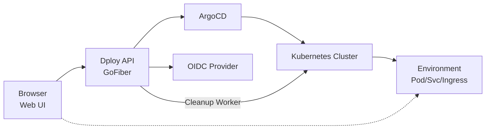
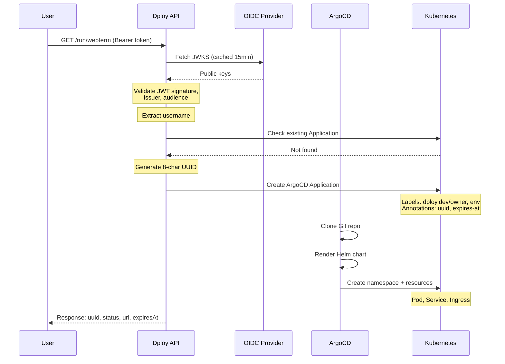
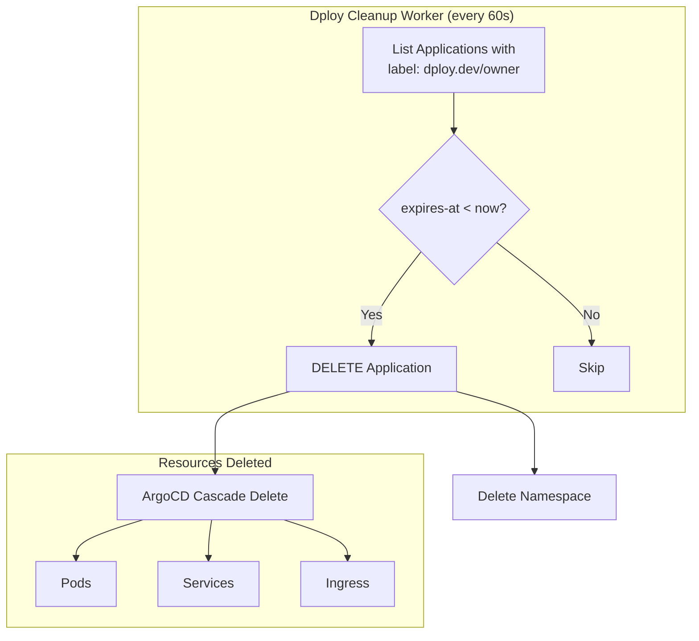
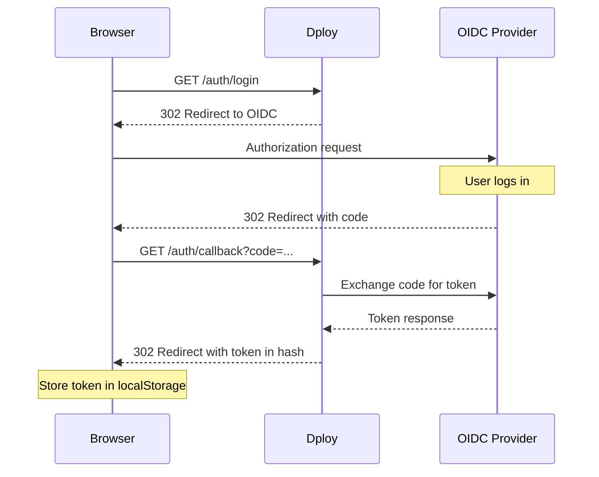

# Architecture

This document describes the technical architecture of Dploy.

## Overview



## Components

### Dploy API

The core Go application built with GoFiber:

- **HTTP Server**: Handles REST API requests and serves static web UI
- **JWT Validator**: Validates tokens using JWKS endpoint
- **OIDC Handler**: Manages authorization code flow
- **Kubernetes Client**: Creates/manages ArgoCD Applications

### ArgoCD

Provides GitOps-based application deployment:

- **Application Controller**: Syncs applications to desired state
- **Repo Server**: Fetches and renders Helm charts from Git
- **Auto-sync**: Continuously reconciles actual vs desired state

### Cleanup Worker

Built-in background worker for automatic TTL cleanup:

- **Goroutine**: Runs as part of the Dploy API process
- **Interval**: Configurable via `CLEANUP_INTERVAL` (default: 60 seconds)
- **Matcher**: Finds Applications with `dploy.dev/owner` label
- **Condition**: Checks `dploy.dev/expires-at` annotation
- **Action**: Deletes expired applications and their namespaces

### OIDC Provider

External identity provider (Dex, Keycloak, Okta):

- Issues JWT tokens
- Provides JWKS endpoint for validation
- Handles user authentication

## Data Flow

### Environment Creation



### Automatic Cleanup



## Resource Naming

All resources follow a consistent naming pattern:

| Resource | Pattern | Example |
|----------|---------|---------|
| Application | `{user}-{env}-{uuid}` | `john-doe-webterm-a1b2c3d4` |
| Namespace | `{user}-{env}-{uuid}` | `john-doe-webterm-a1b2c3d4` |
| Ingress Host | `{user}-{uuid}.{domain}` | `john-doe-a1b2c3d4.env.dploy.dev` |

The UUID is 8 characters, derived from a full UUID with hyphens removed.

## Labels and Annotations

### Labels (for querying)

```yaml
labels:
  dploy.dev/owner: "john-doe"      # Sanitized username
  dploy.dev/env: "webterm"         # Environment type
```

### Annotations (for metadata)

```yaml
annotations:
  dploy.dev/uuid: "a1b2c3d4"                    # Short UUID
  dploy.dev/expires-at: "2024-01-15T16:00:00Z"  # ISO 8601 expiry
```

## Authentication Flow



## Security Model

### JWT Validation

1. Token signature verified against JWKS public keys
2. Issuer claim must match `JWT_ISSUER`
3. Audience claim must match `JWT_AUDIENCE`
4. Username extracted from configurable claim

### Username Sanitization

Raw usernames are sanitized for Kubernetes compatibility:

```
john.doe@example.com → john-doe-example-com
```

- Lowercase conversion
- Dots and @ replaced with hyphens
- Non-alphanumeric characters removed

### Namespace Isolation

Each environment runs in its own namespace:
- Users can only access their own environments
- Quotas enforced at API level
- TTL cleanup prevents orphaned resources

### RBAC

Dploy API service account has limited permissions:
- ArgoCD Applications: full CRUD
- Namespaces: get, list, delete
- AppProjects: get, list

## Helm Value Injection

Every Helm chart receives these base values:

```yaml
username: "john-doe"
uuid: "a1b2c3d4"
ingressHost: "john-doe-a1b2c3d4.env.dploy.dev"
```

Additional values from `extraValues` are merged and support variable substitution:

```yaml
# Config
extraValues: |
  workspaceName: "${username}-workspace"

# Result
workspaceName: "john-doe-workspace"
```

## Scalability

### Dploy API

- Stateless design allows horizontal scaling
- JWKS cached to reduce OIDC provider load
- Uses Kubernetes watch for real-time updates

### ArgoCD

- Handles hundreds of applications per instance
- Can scale controller replicas for more capacity
- Repo server caches Git clones

### Cleanup Worker

- Runs as goroutine within Dploy API process
- Configurable interval (default: 60 seconds)
- Delete operations are idempotent (safe with multiple replicas)
- Minimal cluster load

## High Availability

For production:

1. **Dploy API**: Run 2+ replicas behind load balancer
2. **ArgoCD**: Deploy in HA mode with multiple replicas
3. **Database**: ArgoCD uses etcd (same as cluster)

## Monitoring

Integration points for observability:

- **Prometheus**: Scrape `/metrics` endpoint (TODO)
- **Grafana**: Dashboard for environment stats
- **ArgoCD metrics**: Application sync status
- **Cleanup logs**: Worker logs cleanup operations

## Why REST API Instead of an Operator?

Dploy is intentionally designed as a simple REST API rather than a Kubernetes Operator. Here's why:

### What Dploy Actually Does

Dploy is essentially a thin wrapper that:

1. **Authenticates users** via JWT/OIDC
2. **Creates ArgoCD Applications** with proper labels and annotations
3. **Runs a simple cleanup worker** for TTL-based deletion
4. **Delegates deployment** to ArgoCD

That's it. No complex reconciliation loops, no custom resource definitions, no controller logic.

### Why an Operator Would Be Overkill

| Aspect | Operator | Dploy REST API |
|--------|----------|----------------|
| **Complexity** | Custom CRDs, controller, reconciliation loops | Simple HTTP handlers |
| **Dependencies** | controller-runtime, kubebuilder | Just client-go |
| **State Management** | Operator must track and reconcile state | ArgoCD already does this |
| **Cleanup Logic** | Custom finalizers, garbage collection | Simple background worker |
| **Deployment** | Complex RBAC, leader election, webhooks | Single deployment |
| **Development** | Months of development | Days of development |

### Leveraging Existing Tools

Instead of reinventing the wheel:

- **ArgoCD** handles GitOps, sync, health checks, and cascade deletion
- **OIDC Provider** handles authentication
- **Built-in cleanup worker** handles TTL-based deletion (simple goroutine)

Dploy just needs to:
- Validate the JWT ✓
- Generate a unique name ✓
- Create an ArgoCD Application manifest ✓
- Return a URL ✓

### The KISS Principle

```
User Request → JWT Validation → Create ArgoCD App → Done
```

No need for:
- ❌ Custom Resource Definitions
- ❌ Reconciliation loops
- ❌ Finalizers
- ❌ Status subresources
- ❌ Webhooks
- ❌ Leader election

### When Would an Operator Make Sense?

An Operator would be justified if Dploy needed to:

- Manage complex multi-resource lifecycles beyond what ArgoCD provides
- Implement custom scheduling or placement logic
- Handle stateful operations that require careful ordering
- Provide a declarative API for GitOps workflows

Since ArgoCD already provides all of this, an Operator would just add unnecessary complexity.
