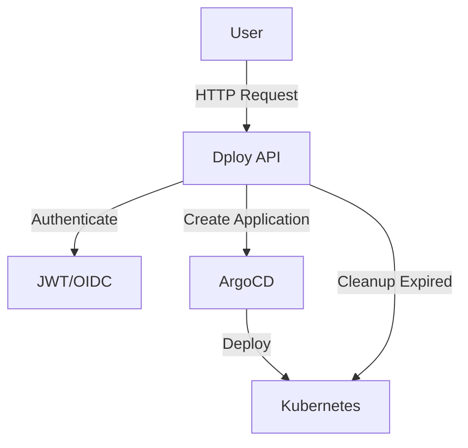

# Getting Started with Dploy

Welcome to **Dploy** - launch ephemeral Kubernetes environments instantly.

## What is Dploy?

Dploy is an all-in-one solution for managing temporary Kubernetes environments via ArgoCD Applications and Git-based Helm charts. It provides a simple web UI and API to deploy, manage, and automatically clean up development environments.

## Key Features

- **Embedded Web UI** - Modern interface with real-time updates
- **Single Container** - API + Frontend in one Docker image
- **Fast** - Built with GoFiber framework
- **Secure** - JWT/OIDC authentication via JWKS
- **Simple Config** - YAML-based, no CRDs needed
- **Git Charts** - Deploy Helm charts from Git repositories
- **Auto Management** - ArgoCD handles GitOps
- **Quotas & TTL** - Automatic cleanup and limits
- **Native K8s** - Uses official client-go

## Tech Stack

- Go 1.23+ with GoFiber
- Kubernetes client-go
- JWT authentication
- ArgoCD for GitOps
- Built-in TTL cleanup worker
- Vanilla JavaScript frontend

## Quick Start

```bash
# Clone and setup with Kind
git clone https://github.com/AYDEV-FR/dploy.git
cd dploy
./dev/setup.sh

# Access the UI
open http://dploy.localhost
```

This creates a complete local environment with:
- Kind cluster (3 nodes)
- NGINX Ingress
- ArgoCD
- Dex (OIDC)
- Prometheus + Grafana
- Dploy API

## How It Works



Each environment:
1. Gets a unique 8-character UUID
2. Creates an ArgoCD Application
3. Deploys to namespace: `{user}-{env}-{uuid}`
4. Gets ingress: `{user}-{uuid}.env.dploy.localhost`
5. Auto-deletes after TTL expires

## Next Steps

- [Installation](/docs/installation) - Deploy to production
- [Configuration](/docs/configuration) - Setup environment variables
- [Environments](/docs/environments) - Define available environments
- [Web UI Guide](/docs/guide/web-ui) - Use the interface
- [API Reference](/docs/api/overview) - Explore REST endpoints
